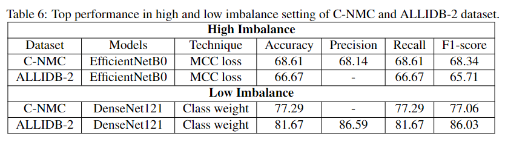

# Quantifying imbalanced classification methods for leukemia detection 

This codebase is part of supplementary materials of our paper *"__Quantifying imbalanced classification methods for leukemia detection__"*
***
## Authors: 
Deponker Sarker Depto, Md. Mashfiq Rizvee, Aimon Rahman, Hasib Zunair, M Sohel Rahman and M.R.C. Mahdy

## Short Description: 
Leukemia is a cancer of the body's blood-forming tissues, including the bone marrow and the lymphatic system. There's a good chance of survival if leukemia is detected early. But imbalance is a crucial issue in medical imaging and diagonosis results of leukemia by CAD systems becomes often skewed. Through our effort we have tried to alleviate the imbalance class problem for leukemia detection.


Figure: We have presented classified and misclassified samples and their corresponding superimposed feature maps from best models to input images.

## Published Paper Link
[Quantifying imbalanced classification methods for leukemia detection](https://www.sciencedirect.com/science/article/abs/pii/S0010482522010800)

## Citation
  ```sh
 @article{depto2023quantifying,
  title={Quantifying imbalanced classification methods for leukemia detection},
  author={Depto, Deponker Sarker and Rizvee, Md Mashfiq and Rahman, Aimon and Zunair, Hasib and Rahman, M Sohel and Mahdy, MRC},
  journal={Computers in Biology and Medicine},
  volume={152},
  pages={106372},
  year={2023},
  publisher={Elsevier}
}
  ```

## DOI
https://doi.org/10.1016/j.compbiomed.2022.106372

## Requirments
This work requirs
- Python:     3.8.1
- Tensorflow: 2.3.0
- Keras:      2.4.0

## Imbalance Scanario
We provide bar-chart depiction of imbalanced scanarios


## Results
We report the best scores from our implemented models


## License
Distributed under the MIT License.
